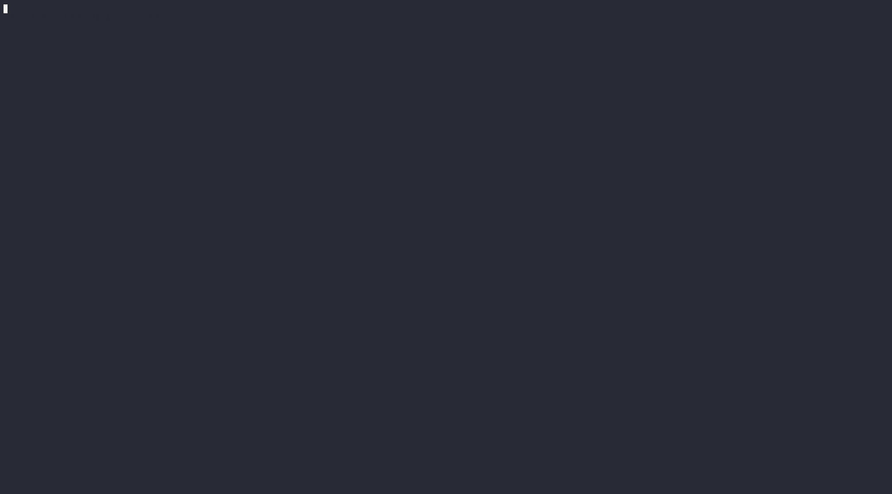

# Kopts

Kopts is a package for easier Kubernetes object creation.

Kopts leverages functional options (Kopts is Kubernetes Options) to build the K8s API objects instead of bare structs, in turn drastically cutting down on the boilerplate needed.

For example, to create a deployment you would normally need:

```go
var replicas = int32(1)
deployment := appsv1.Deployment{
    TypeMeta: metav1.TypeMeta{}
    ObjectMeta: metav1.ObjectMeta{
        Name: "mydeployment",
        Namespace: "mynamespace"
    },
    Spec: appsv1.DeploymentSpec{
        Replicas: &replicas,
        Selector: &metav1.LabelSelector{
                MatchLabels: map[string]string{
                        "app": "myapp",
                    },
        },
        Template: corev1.PodTemplateSpec{
            ObjectMeta: metav1.ObjectMeta{
                Name: "mypod",
                Labels: map[string]string{
                    "app": "myapp",
                },
            },       
            Spec: corev1.PodSpec{
                Colntainers: []corev1.Container{
                    {
                        Name: "myapp",
                        Image: "myapp/myapp",
                        ImagePullPolicy: "IfNotPresent",
                        Env: []corev1.EnvVar{
                            {
                                Name: "SERVER_PORT",
                                Value: fmt.Sprintf("%d, 8080),
                            }
                        }
                    }
                }
            }
        },
    },
}
```


Whereas with kopts all you need is the following:

```go
c := kopts.NewContainer("myapp",
    kopts.ContainerImage("myapp/myapp"),
    kopts.ContainerEnvVar("SERVER_PORT", "8080"),
    kopts.ContainerImagePullPolicy("IfNotPresent"),
)

p := kopts.NewPodSpec("myapp",
    kopts.PodLabel("foo", "bar"),
    kopts.PodContainer(c),
)

d := kopts.NewDeployment("mydeployment",
    kopts.DeploymentNamespace("mynamespace"),
    kopts.DeploymentSelector("app", "myapp"),
    kopts.DeploymentReplicas(1),
    kopts.DeploymentPodSpec(p),
)
```

Since kopts uses functional options to build all of the API objects, you can also add fields later on. For instance to satisfy conditionals:

```go
d := kopts.NewDeployment("mydeployment",
    kopts.DeploymentNamespace("mynamespace"),
    kopts.DeploymentSelector("app", "myapp"),
    kopts.DeploymentReplicas(1),
    kopts.DeploymentPodSpec(p),
)

if os.Getenv("ENVIRONMENT") == "PROD" {
    f := kopts.DeploymentReplicas(3)
    f(&d)
}
```

Kopts uses the `sigs.k8s.io` YAML marshaler. To print out a YAML string just call the MarshalYaml function:

```go
data, err := kopts.MarshalYaml(i)
if err != nil {
	log.Fatal(err)
}

fmt.Print(data)
```

The marshaler will automatically include the `---` at the top of the string to make printing multiple objects easier.

## Demo

Demo putting all the pieces together:




## More Examples
For more in depth examples take a look at the [example](examples/main.go).

## We will continue to add features

In case there isn't an option for the property you need, you still have access to the underlying K8s struct.
You can just reference that object and modify the property directly.

For example imagine that setting a container pull policy wasn't availble yet, you could simply:

```go
c := kopts.NewContainer("myapp",
    kopts.ContainerImage("myapp/myapp"),
    kopts.ContainerEnvVar("SERVER_PORT", "8080"),
)

c.ImagePullPolicy = "Always"

```